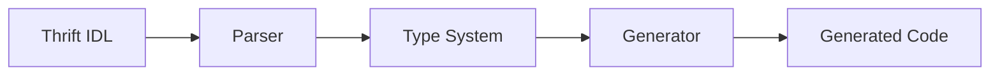

# Generators Overview

ContractForge uses **generators** to transform Thrift IDL files into working
code for different platforms and purposes.

## What Are Generators?

Generators are code generation engines that:

1. Parse your Thrift IDL files
2. Build a type system representation
3. Generate platform-specific code using templates
4. Output ready-to-use code files

## Available Generators

ContractForge currently provides three generators:

### C# JSON API (`csharp-jsonapi`)

Generates ASP.NET Core server code with:

- Abstract controller classes
- DTO models (structs, exceptions, unions)
- Dependency injection patterns
- Support for streaming with `IAsyncEnumerable<T>`

**[Learn more →](csharp-jsonapi.md)**

### TypeScript Client (`typescript-client`)

Generates web-standards TypeScript clients with:

- Fetch API-based HTTP client
- Optional fetch credentials support for cookie-based auth
- Full TypeScript type definitions
- Streaming support with `AsyncIterable<T>`
- Works in Node.js, Deno, Bun, and browsers

**[Learn more →](typescript-client.md)**

### OpenAPI (`openapi`)

Generates OpenAPI JSON specifications with:

- OpenAPI 3.0.3 by default
- Optional OpenAPI 3.1.0 output
- Component schemas for structs, exceptions, enums, and unions
- Paths matching the generated JSON API routes
- JSON and NDJSON response media types for `list<T>` returns

**[Learn more →](openapi.md)**

## Using Generators

### Basic Usage

```bash
contractforge --entry <input.thrift> --generator <generator> --output <output>
```

### Examples

```bash
# Generate C# server
contractforge --entry service.thrift --generator csharp-jsonapi --output Server/Generated/

# Generate TypeScript client
contractforge --entry service.thrift --generator typescript-client --output client.ts

# Generate OpenAPI JSON
contractforge --entry service.thrift --generator openapi --output openapi.json
```

### Common Options

All generators support these options:

- `-e, --entry` - Input Thrift IDL file (required)
- `-o, --output` - Output path (required)
- `--help` - Show generator-specific help

See the [CLI Reference](../reference/cli.md) for complete options.

## How Generators Work



1. **Parser** - ANTLR-based parser reads `.thrift` files
2. **Type System** - Builds internal representation of types, services, etc.
3. **Generator** - Applies templates to generate target code
4. **Output** - Writes generated files to specified location

## Creating Custom Generators

ContractForge's generator system is extensible. You can create custom generators
for:

- Different languages (Python, Java, Go, etc.)
- Different frameworks (Nancy, FastAPI, etc.)
- Different serialization formats
- Custom use cases

Custom generator development is an advanced topic. Check the source code for
`CSharpCodeGen`, `TypescriptCodeGen`, and `OpenApiCodeGen` as reference
implementations.

## Next Steps

Explore each generator in detail:

- **[C# JSON API Generator](csharp-jsonapi.md)** - Server-side code generation
- **[TypeScript Client Generator](typescript-client.md)** - Client-side code
  generation
- **[OpenAPI Generator](openapi.md)** - OpenAPI JSON specification generation
